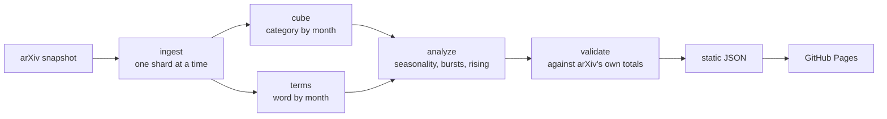

# TrendXiv

**[See it live](https://tctibbs.github.io/TrendXiv/)** &middot;
[Getting started](docs/getting-started.md) &middot;
[Development](docs/development.md) &middot;
[Data contract](docs/data-contract.md)

Which research topics are actually growing on arXiv, and which ones only look
like they are. Built from all 3,148,882 papers going back to 1991.

There is no server and no database. A weekly job turns the whole arXiv corpus
into a handful of static JSON files, GitHub Pages serves them, and the browser
downloads about 240 KB and draws the charts itself.

## Why not just count papers

arXiv is about 102 times bigger than it was in 1992 and still adding roughly 27%
more papers each year. Raw word mentions mostly end up counting that growth, so
almost everything slopes up, including topics that are quietly shrinking.
TrendXiv shows share of the corpus instead.

Everything else follows from that:

| | Method | Why |
|---|---|---|
| **Uncertainty bands** | [Wilson intervals](https://en.wikipedia.org/wiki/Binomial_proportion_confidence_interval#Wilson_score_interval), widened for [overdispersion](https://en.wikipedia.org/wiki/Overdispersion) | The usual interval breaks down at zero, where every new term starts |
| **Burst detection** | [Kleinberg's](https://en.wikipedia.org/wiki/Jon_Kleinberg) state automaton | Dated intervals you can check, not a wiggly line |
| **Rising board** | [Empirical Bayes](https://en.wikipedia.org/wiki/Empirical_Bayes_method), then [FDR control](https://en.wikipedia.org/wiki/False_discovery_rate) | One paper becoming five is not a breakout |
| **Deadline fingerprint** | [STL decomposition](https://en.wikipedia.org/wiki/Decomposition_of_time_series) | cs.CV peaks in March, around CVPR. math.AP is nearly round |
| **Provisional masking** | Trailing months hatched and excluded | Otherwise the current month reads as an 87% collapse |

## How it fits together

Every build checks its own totals against arXiv's published monthly counts. It
currently agrees to within 0.122% overall and 0.3% for every decade.

The statistics all happen offline in Python. The browser gets finished numbers
and draws them.

## Known limitations

Papers are counted in the month they were **first posted**, so revising an old
paper cannot move it into the present. A paper counts in every field it is
listed under, which is what arXiv's own `cat:` search does, so a number here
should match what you find there.

Three things no free source can fix:

1. **Fields are recorded as they stand today.** A 2010 paper added to machine
   learning in 2024 still counts as machine learning back in 2010, so today's
   fashions get painted onto the past.
2. **Titles and abstracts are the latest version.** A 2016 paper revised in 2025
   can appear to use a 2025 word in 2016.
3. **arXiv is not all of science.** High energy physics posts nearly everything,
   chemistry and clinical medicine post very little, so comparing across fields
   partly measures posting habits.

## Licence

MIT. arXiv metadata is CC0, with thanks to arXiv for supporting open access.
TrendXiv is an independent project and is not affiliated with or endorsed by
arXiv or Cornell University.
