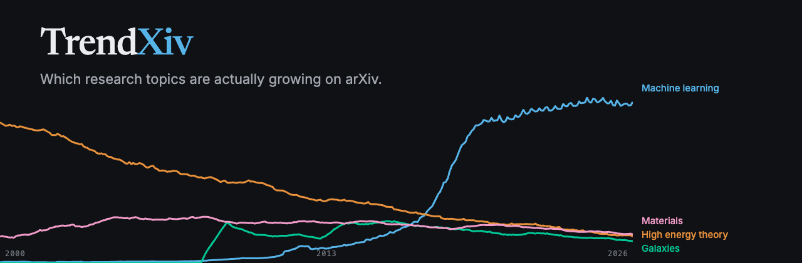

# TrendXiv

**[See it live](https://tctibbs.github.io/TrendXiv/)** &middot;
[Getting started](docs/getting-started.md) &middot;
[Development](docs/development.md) &middot;
[Data contract](docs/data-contract.md)

Which research topics are actually growing on arXiv, and which ones only look
like they are. Built from all 3,148,882 papers going back to 1991.

There is no server and no database. A weekly job turns the whole arXiv corpus
into a handful of static JSON files, GitHub Pages serves them, and the browser
downloads about 240 KB and draws the charts itself. The whole thing runs on free
tiers.

## Why not just count papers

arXiv is about 102 times bigger than it was in 1992 and still adding roughly 27%
more papers each year. Count raw mentions of a word and you are mostly counting
that growth, so almost everything slopes up, including topics that are quietly
shrinking. TrendXiv shows share of the corpus instead, names the denominator on
the axis, and puts the raw numerator in every tooltip.

Everything else follows from that:

| | What it does | Why it matters |
|---|---|---|
| **Uncertainty bands** | Wilson intervals, widened for the clustering real papers show | The usual interval breaks down at zero, which is where every new term starts |
| **Burst detection** | Kleinberg's algorithm, which gives dated intervals instead of a wiggly line | "GW150914 broke out in February 2016" is a claim you can check |
| **Rising board** | Shrinks rare terms first, then controls for false discoveries | One paper becoming five is not a breakout |
| **Deadline fingerprint** | Month-of-year seasonal shape per field | cs.CV peaks in March, around CVPR. math.AP is nearly round |
| **Provisional masking** | The trailing incomplete months are hatched and kept out of every calculation | Otherwise the current month reads as an 87% collapse |

## How it fits together

```
Weekly GitHub Actions job
  │
  ├─ ingest    DuckDB reads the arXiv snapshot one shard at a time
  ├─ cube      category by month, in three attribution modes
  ├─ terms     term by month, sharded by first letter
  ├─ analyze   seasonality, bursts, rising terms, lifecycle fits
  └─ validate  checks the totals against arXiv's own published numbers
  │
  ▼
static JSON  ──►  GitHub Pages
```

Every build checks its own totals against arXiv's published monthly counts. It
currently agrees to within 0.122% overall and 0.3% for every decade.

The statistics all happen offline in Python, under test. The browser gets
finished numbers and draws them.

## What this data cannot tell you

Papers are counted in the month they were **first posted**, never the month they
were last edited, so revising an old paper cannot move it into the present.
A paper counts in every field it is listed under, which is what arXiv's own
`cat:` search does, so a number here should match what you find there.

Three limits no free source can fix. The site says the same three things:

1. **Fields are recorded as they stand today.** A 2010 paper added to machine
   learning in 2024 still counts as machine learning back in 2010, so today's
   fashions get painted onto the past.
2. **Titles and abstracts are the latest version.** A 2016 paper revised in 2025
   can appear to use a 2025 word in 2016.
3. **arXiv is not all of science.** High energy physics posts nearly everything,
   chemistry and clinical medicine post very little, so comparing across fields
   partly measures posting habits.

## Licence

MIT. arXiv metadata is CC0, with thanks to arXiv for supporting open access.
TrendXiv is an independent project and is not affiliated with or endorsed by
arXiv or Cornell University.
